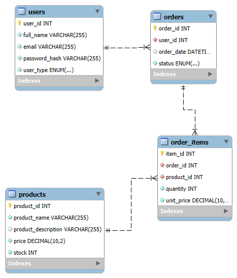

# 📌 Database Security & Management Project

This project was developed to apply concepts of database management, security, and backup & recovery, using MySQL and Python to enhancing my knowledge and helping people with my logic and algorithms.  

## 🚀 Technologies Used
MySQL → Relational database to store and manage data.

Python → Used for automation and database integration.

Faker → Generates realistic fake data.

MySQL Connector → Connects Python to MySQL.  

## ⚙️ Features Implemented

✅ Database and Table Creation → Well-structured database schema.  
✅ Data Population → Automatically generates fake records to populate the database.  
✅ Backup & Restore → Automated system to protect and recover data.  

## 💾 Backup & Restore System

Automatic backups are created before any major database changes.

The system allows restoring the database from a .sql backup file.  

#🛠 How to Run the Project?

## 🗂 Database Schema

Below is the database structure:



### 1️⃣ Clone the repository

```
https://github.com/Nicollas-str/DBA_PROJECT.git
```
### 2️⃣ Install Python dependencies
```
pip install mysql-connector-python faker
```
### 3️⃣ Set up your MySQL database
```
CREATE DATABASE database;
```
### 4️⃣ Configure the database connection in config.py
```
db_config = {
    "host": "localhost",
    "user": "your_user",
    "password": "your_password",
    "database": "your_database"
}
```
### 5️⃣ Run the Python scripts
```
python populate.py
python backup.py
```
# 📜 License

### This project is licensed under the MIT License.

